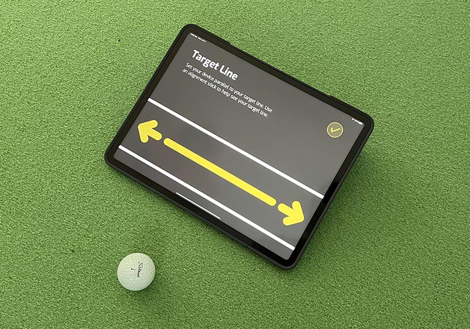
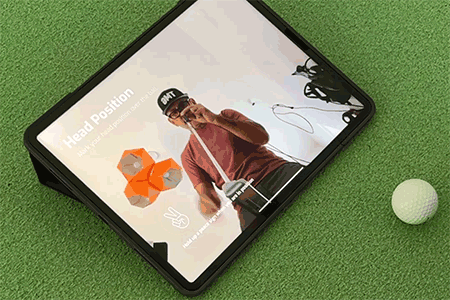

# Body Tracking Alignment Aid
## Use a mobile device as a mirror to achieve proper setup

Golfers often struggle with consistant alignment at setup. For putting, it's generally accepted that we want our shoulders square to the target line, and our eyes directly over the ball. This app is used with the device on the ground, facing up at the user. Once calibrated to the ideal position, it shows both an eye line and a shoulder line to help a player confirm they are setup corretly.

To use the app, the player would put their device on the ground, align the large arrow parallel to their target line, calibrate their eye position, then go ahead and start rolling putts.

## Tech

- [iOS] - Built for iPhone and iPads
- [CoreML] - Train hand gestures, use "peace sign" as input
- [Vision SDK] - Human body tracking and hand gesture recognition